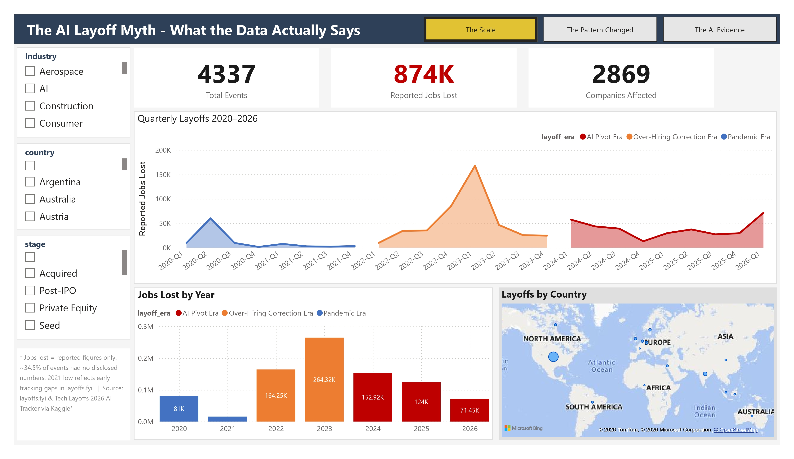
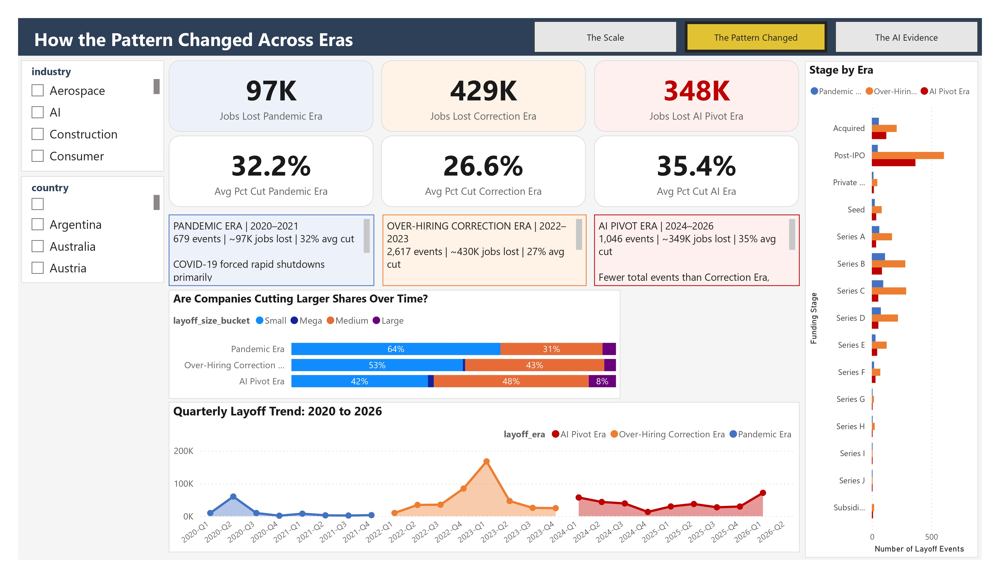
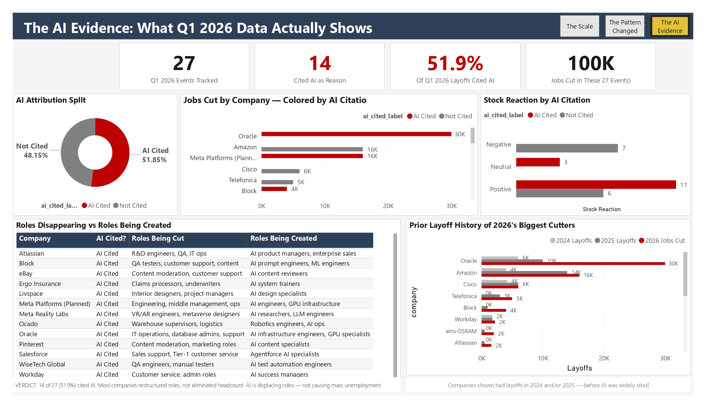

# The AI Layoff Myth - What the Data Actually Says


## Project Overview

A data analytics portfolio project investigating whether the surge in layoffs during 2024–2026 is driven by AI adoption — or whether companies are using AI as a convenient narrative for decisions rooted in traditional business factors.

The project builds an end-to-end pipeline from raw CSV data through MySQL cleaning and transformation, into a three-page interactive Power BI dashboard.

**Central question:** Are people being replaced by AI, or are layoffs happening for the same reasons they always have?

---

## The Verdict

Of 27 major Q1 2026 layoffs tracked with AI attribution data, **51.9% (14 of 27) explicitly cited AI** as a contributing reason. However, most of those companies simultaneously grew total headcount year-over-year, and several had significant layoffs in 2024 and 2025 before AI became the stated justification.

**Conclusion:** AI is reshaping job *roles* more than it is eliminating employment overall. This is a displacement problem, not a mass unemployment crisis — at least in the data available to date.

---

## Dashboard Preview

### Page 1 — The Scale
> 4,337 layoff events · 874K reported jobs lost · 2,882 companies · 66 countries · 2020–2026



### Page 2 — How the Pattern Changed
> Era-by-era comparison showing structural shifts across Pandemic, Correction, and AI Pivot eras



### Page 3 — The AI Evidence
> Direct AI attribution data from Q1 2026 — roles disappearing, roles being created, market reactions



---

## Key Findings

| Finding | Detail |
|---|---|
| Peak layoff quarter | **2023 Q1** — 167,674 reported jobs lost |
| Hardest-hit company | **Amazon** — 58,124 total jobs lost across all years |
| AI Pivot Era avg cut | **35.4%** of workforce per event vs 26.6% in Correction Era |
| AI citation rate (2026) | **51.9%** of major tracked Q1 2026 events cited AI |
| Stock market reward | **78%** of AI-cited layoffs got a positive stock reaction vs 46% for non-AI cited |
| Roles disappearing | QA testers, customer support, content moderators, IT operations |
| Roles being created | AI engineers, ML engineers, AI prompt specialists, GPU infrastructure |

---

## Tech Stack

| Layer | Tool | Purpose |
|---|---|---|
| Data Storage | MySQL 8.0 | Schema design, cleaning, transformation, analytical views |
| Visualization | Power BI Desktop | Three-page interactive dashboard |
| Query Language | SQL | Data cleaning, derived columns, 8 analytical views |
| Data Measures | DAX | 20+ measures across 5 groups |
| Data Source | Kaggle (layoffs.fyi) | Primary dataset — 4,342 layoff events |
| Data Source | Kaggle (AI Tracker) | Supplement — 27 Q1 2026 events with AI attribution |

---

## Project Structure

```
The-AI-Layoff-Myth-What-the-Data-Actually-Says/
│
├── README.md                          ← You are here
├── The_AI_Layoff_Myth.pbix            ← Power BI dashboard file
│
├── data/
│   ├── layoffs.csv                    ← Primary dataset (layoffs.fyi via Kaggle)
│   └── tech_layoffs_2026_tracker.csv  ← AI attribution supplement (Kaggle)
│
├── sql/
│   └── The_AI_Layoff_Myth.sql         ← Full MySQL pipeline (schema + cleaning + views)
│
├── presentation/
│   └── The_AI_Layoff_Myth_Presentation.pptx  ← Project walkthrough slides
│
└── screenshots/
    ├── page1_the_scale.png            ← Dashboard screenshots
    ├── page2_the_pattern.png
    └── page3_the_evidence.png
```

---

## How to Run This Project

### Prerequisites
- MySQL 8.0 or higher
- MySQL Workbench (recommended) or any MySQL client
- Power BI Desktop (free — download from Microsoft)

### Step 1 — Set Up the Database

```sql
-- Run the full SQL script in MySQL Workbench
-- File: sql/The_AI_Layoff_Myth.sql
-- This creates the database, imports data, cleans it, and builds all views
```

1. Open MySQL Workbench
2. Open `sql/The_AI_Layoff_Myth.sql`
3. Update the file path in the LOAD DATA section to match your local `data/` folder
4. Run the script section by section (follow the section headers)
5. Verify with the checklist in Section 10 of the SQL file

### Step 2 — Connect Power BI to MySQL

1. Open `The_AI_Layoff_Myth.pbix` in Power BI Desktop
2. If prompted for data source credentials:
   - Home → Transform Data → Data Source Settings
   - Edit credentials → enter your MySQL username and password
3. Click Refresh — all visuals will populate

### Step 3 — Explore the Dashboard

- Use the navigation buttons (top-right of each page) to move between pages
- Use the slicers (left panel) to filter by Industry, Country, or Company Stage
- KPI cards respond to slicer selections; charts show macro-level context

---

## Data Sources

| Dataset | Source | Rows | Coverage |
|---|---|---|---|
| layoffs.csv | [layoffs.fyi via Kaggle](https://www.kaggle.com) | 4,342 | Mar 2020 – Apr 2026 |
| tech_layoffs_2026_tracker.csv | [Kaggle — AI Layoffs Tracker](https://www.kaggle.com) | 27 | Q1 2026 |

### Data Limitations

- **Underreporting:** 34.5% of layoff events did not disclose exact job numbers. All totals represent reported figures only.
- **2021 gap:** Only 44 events tracked in 2021 — reflects early coverage limitations of layoffs.fyi, not an actual absence of layoffs.
- **US-heavy:** 64% of events are from the United States. Global coverage, especially Asia and Africa, is underrepresented.
- **Self-reported AI:** AI attribution in the 2026 tracker is company self-reported and may reflect PR strategy as much as operational reality.
- **Q1 2026 only:** AI attribution data covers only Q1 2026 (27 major companies). The dataset will evolve as 2026 progresses.

---

## Analytical Framework

The project divides layoff history into three eras based on real-world context:

| Era | Years | Events | Jobs Lost | Avg % Cut | Driver |
|---|---|---|---|---|---|
| Pandemic Era | 2020–2021 | 679 | ~97K | 32.2% | COVID-19 external shock |
| Over-Hiring Correction Era | 2022–2023 | 2,617 | ~430K | 26.6% | Reversing pandemic over-hiring |
| AI Pivot Era | 2024–2026 | 1,046 | ~349K | 35.4% | AI investment + restructuring |

**Key structural finding:** The AI Pivot Era has *fewer* total jobs lost than the Correction Era, but companies are cutting a *larger share* of their workforce per event (35.4% vs 26.6%). This suggests deliberate strategic restructuring rather than reactive cost-cutting.

---

## DAX Measures (Summary)

The dashboard uses 20+ DAX measures organized in 5 groups:

- **Core counts:** Total Events, Reported Jobs Lost, Companies Affected, Avg % Workforce Cut
- **Era comparisons:** Jobs Lost per era, Avg % Cut per era
- **Time intelligence:** YoY Change %, Cumulative Jobs Lost
- **AI evidence:** AI Cited Count, AI Cited %, Stock Reaction rates, Investment comparisons
- **Display formatting:** K/M suffix formatting for KPI cards

---

## Author

**Syed Rehan**
Data Analytics Portfolio Project · 2026

---

*Data sourced from layoffs.fyi (via Kaggle) and a Q1 2026 AI layoffs tracker (Kaggle). All analysis is the author's own. This project is for educational and portfolio purposes.*

